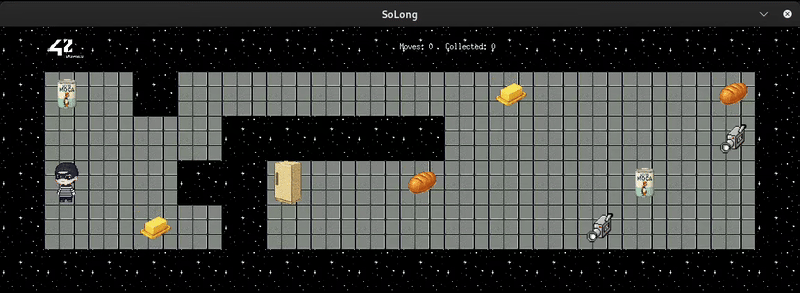

# so_long
<p align="center">
  
</p>
So_long is a project from 42 school (École 42) in C designed to create your own 2D game in C.

## Overview

`so_long` is a small 2D game project using the MiniLibX graphics library.  
The objective of the game is to move the player through a map, collect all collectibles, and reach the exit — while ensuring the map is valid and all game elements are reachable.

This project focuses on:
- Working with a simple graphics engine (MiniLibX)
- Event handling (keyboard input, window control)
- Basic game loop logic
- Validating and parsing map files
- Pathfinding to confirm map solvability

---

## Features

- Loads and displays a `.ber` map file
- Controls player movement using keyboard inputs
- Counts and displays steps taken
- Ensures all collectibles are gathered before exiting
- Validates map structure:
  - Must be fully enclosed by walls
  - Must contain **1** player, **1** exit, and at least **1** collectible
  - Must have only allowed characters
- Pathfinding check guarantees the map is solvable

---

## Controls

| Key | Action        |
|-----|---------------|
| W   | Move Up       |
| A   | Move Left     |
| S   | Move Down     |
| D   | Move Right    |
| ESC | Quit Game     |

---

## Map Format

Maps must be rectangular and stored in `.ber` files.

Example:

```
1111111
1P0C0E1
1000001
1111111
```

Legend:
- `1` = Wall
- `0` = Empty floor
- `P` = Player start
- `C` = Collectible
- `E` = Exit

---

## Running the Game

### Requirements
For building this project you may need to install some required graphical libraries. If you use Linux, just run in your terminal:
```bash
sudo apt-get update && sudo apt-get install xorg libxext-dev zlib1g-dev libbsd-dev
```

More information or other O.S, please check the [documentation](https://harm-smits.github.io/42docs/libs/minilibx/getting_started.html).

### Build
```bash
make
```

### Run
```bash
./so_long maps/map.ber
```

---

## Bonus

- Enemy that patrols or moves
- Sprites/animations
- Step counter displayed on screen

---

## Author

**BabiDrummond** – Student at École 42.
